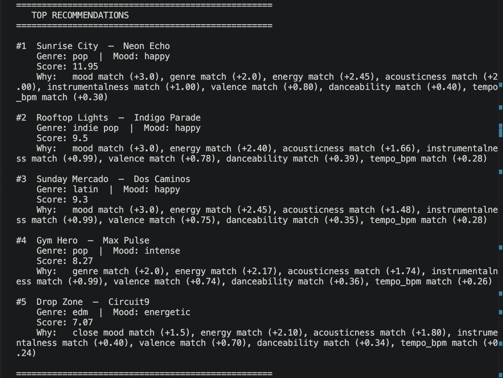

# 🎵 Music Recommender Simulation

## Project Summary

In this project you will build and explain a small music recommender system.

Your goal is to:

- Represent songs and a user "taste profile" as data
- Design a scoring rule that turns that data into recommendations
- Evaluate what your system gets right and wrong
- Reflect on how this mirrors real world AI recommenders

Replace this paragraph with your own summary of what your version does.

---

## How The System Works

Explain your design in plain language.
Real world recommenders build a mathematical fingerprint of your taste from your listening behavior, then surface content cosest to that fingerprint combining what songs sound like with what similar users played.

What my version will prioritize is : given few liked songs, it builds a taste profile from their audio features and scores every other song by how closely it matches weighting mood and energy highest, because those reflect why you're listening, not just what you generally like.


### `Song` Features

| Feature | Type | Example |
|---|---|---|
| `id` | int | `2` |
| `title` | str | `"Midnight Coding"` |
| `artist` | str | `"LoRoom"` |
| `genre` | str | `"lofi"` |
| `mood` | str | `"chill"` |
| `energy` | float [0,1] | `0.42` |
| `tempo_bpm` | float (normalized) | `0.30` |
| `valence` | float [0,1] | `0.56` |
| `danceability` | float [0,1] | `0.62` |
| `acousticness` | float [0,1] | `0.71` |

### `UserProfile` Features

| Feature | Type | How It's Built |
|---|---|---|
| `liked_song_ids` | list[int] | Songs the user marked as liked |
| `dominant_mood` | str | Most frequent mood across liked songs |
| `dominant_genre` | str | Most frequent genre across liked songs |
| `avg_energy` | float | Mean energy of liked songs |
| `avg_tempo` | float | Mean normalized tempo of liked songs |
| `avg_valence` | float | Mean valence of liked songs |
| `avg_danceability` | float | Mean danceability of liked songs |
| `avg_acousticness` | float | Mean acousticness of liked songs |

The `Song` stores raw data. The `UserProfile` stores derived averages - the mathematical fingerprint computed from songs the user liked.

---

## Terminal Output



---

## Algorithm Recipe

### How Scores Are Computed

1. **Load & normalize** — read `songs.csv`, normalize `tempo_bpm` to `[0,1]`
2. **Filter** — remove songs already in `liked_song_ids`
3. **Score each song** using weighted proximity:

| Feature | Weight | Method |
|---|---|---|
| `mood` | 0.30 | exact match = 1.0, adjacent = 0.5, opposite = 0.0 |
| `energy` | 0.25 | `1 - abs(song - profile)` |
| `acousticness` | 0.20 | `1 - abs(song - profile)` |
| `instrumentalness` | 0.10 | `1 - abs(song - profile)` |
| `valence` | 0.08 | `1 - abs(song - profile)` |
| `danceability` | 0.04 | `1 - abs(song - profile)` |
| `tempo` | 0.02 | `1 - abs(song - profile)` |
| `genre` | 0.01 | exact match = 1.0, else 0.0 |

4. **Threshold** — drop songs scoring below `0.50`
5. **Rank** — sort by score descending, return top-K
6. **Explain** — surface the 2 features that contributed most per recommendation

---

## Potential Biases

- **Mood dominance** — mood carries 30% of the score. A song that matches perfectly on every audio feature but has the wrong mood can still rank below a weaker acoustic match. This is intentional but aggressive.
- **Filter bubble** — the system only surfaces songs that sound like what the user already liked. It will never suggest something genuinely surprising or outside the acoustic profile.
- **Small catalog problem** — with 20 songs, multiple songs will cluster near the same score within the chill/acoustic group, making the ranking within that cluster feel arbitrary.
- **Genre underweighted** — genre is only 1% of the score. A great jazz song will score nearly the same as a great ambient song for the same user, even if the user has a strong genre preference.
- **Cold start** — if a user only likes 1 song, the profile averages are that single song's values, which may over-fit to one data point.

---

## Getting Started

### Setup

1. Create a virtual environment (optional but recommended):

   ```bash
   python -m venv .venv
   source .venv/bin/activate      # Mac or Linux
   .venv\Scripts\activate         # Windows

2. Install dependencies

```bash
pip install -r requirements.txt
```

3. Run the app:

```bash
python -m src.main
```

### Running Tests

Run the starter tests with:

```bash
pytest
```

You can add more tests in `tests/test_recommender.py`.

---

## Experiments You Tried

Use this section to document the experiments you ran. For example:

- What happened when you changed the weight on genre from 2.0 to 0.5
- What happened when you added tempo or valence to the score
- How did your system behave for different types of users

---

## Limitations and Risks

Summarize some limitations of your recommender.

Examples:

- It only works on a tiny catalog
- It does not understand lyrics or language
- It might over favor one genre or mood

You will go deeper on this in your model card.

---

## Reflection

Read and complete `model_card.md`:

[**Model Card**](model_card.md)

Write 1 to 2 paragraphs here about what you learned:

- about how recommenders turn data into predictions
- about where bias or unfairness could show up in systems like this


---

## 7. `model_card_template.md`

Combines reflection and model card framing from the Module 3 guidance. :contentReference[oaicite:2]{index=2}  

```markdown
# 🎧 Model Card - Music Recommender Simulation

## 1. Model Name

Give your recommender a name, for example:

> VibeFinder 1.0

---

## 2. Intended Use

- What is this system trying to do
- Who is it for

Example:

> This model suggests 3 to 5 songs from a small catalog based on a user's preferred genre, mood, and energy level. It is for classroom exploration only, not for real users.

---

## 3. How It Works (Short Explanation)

Describe your scoring logic in plain language.

- What features of each song does it consider
- What information about the user does it use
- How does it turn those into a number

Try to avoid code in this section, treat it like an explanation to a non programmer.

---

## 4. Data

Describe your dataset.

- How many songs are in `data/songs.csv`
- Did you add or remove any songs
- What kinds of genres or moods are represented
- Whose taste does this data mostly reflect

---

## 5. Strengths

Where does your recommender work well

You can think about:
- Situations where the top results "felt right"
- Particular user profiles it served well
- Simplicity or transparency benefits

---

## 6. Limitations and Bias

Where does your recommender struggle

Some prompts:
- Does it ignore some genres or moods
- Does it treat all users as if they have the same taste shape
- Is it biased toward high energy or one genre by default
- How could this be unfair if used in a real product

---

## 7. Evaluation

How did you check your system

Examples:
- You tried multiple user profiles and wrote down whether the results matched your expectations
- You compared your simulation to what a real app like Spotify or YouTube tends to recommend
- You wrote tests for your scoring logic

You do not need a numeric metric, but if you used one, explain what it measures.

---

## 8. Future Work

If you had more time, how would you improve this recommender

Examples:

- Add support for multiple users and "group vibe" recommendations
- Balance diversity of songs instead of always picking the closest match
- Use more features, like tempo ranges or lyric themes

---

## 9. Personal Reflection

A few sentences about what you learned:

- What surprised you about how your system behaved
- How did building this change how you think about real music recommenders
- Where do you think human judgment still matters, even if the model seems "smart"

