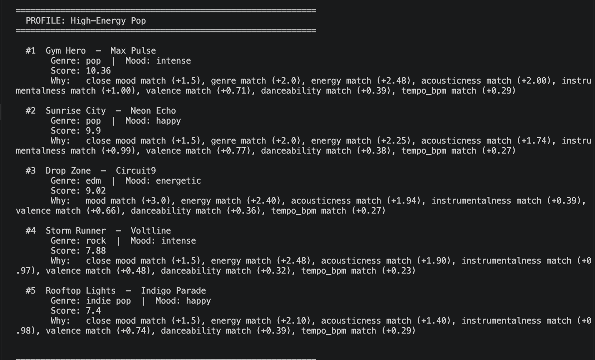
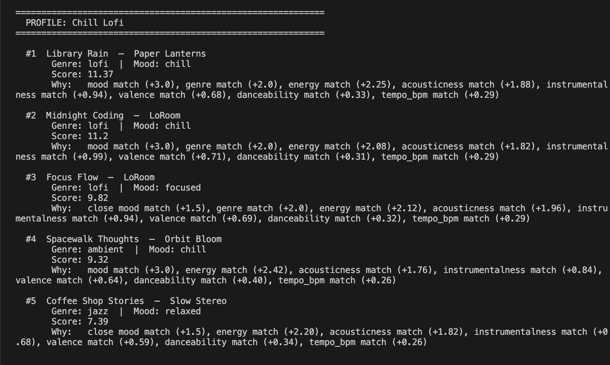
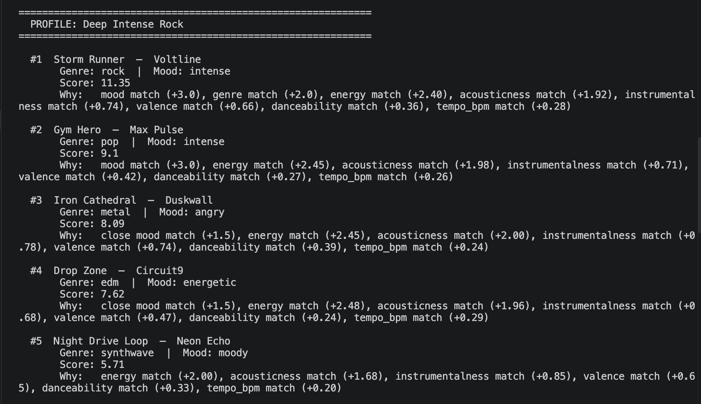
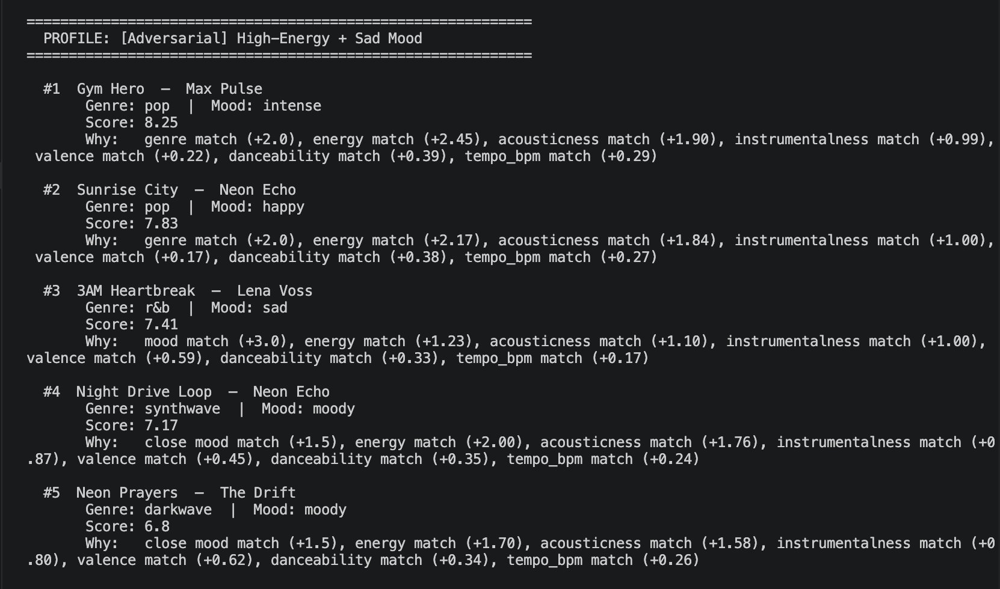
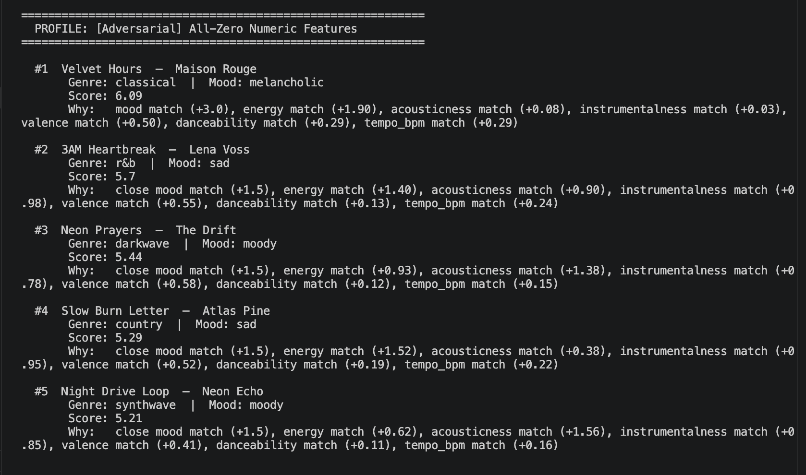
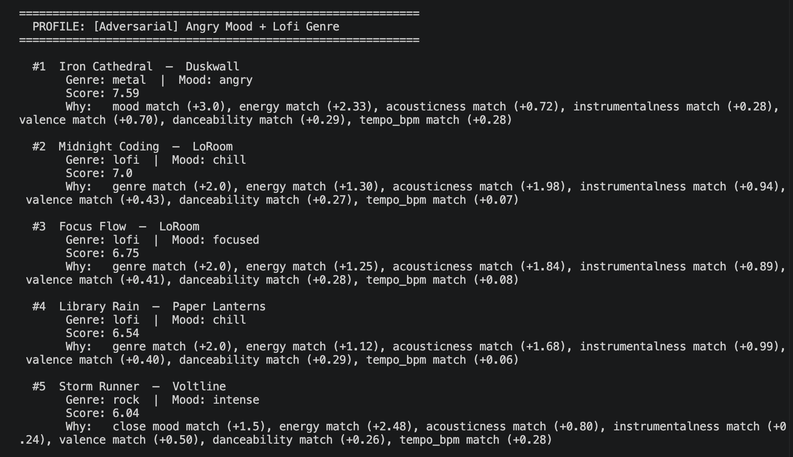

# 🎵 Music Recommender Simulation

## Project Summary

This project builds a small music recommender system from scratch. You give it a user preference profile like genre, mood, and energy level and it scores every song in the catalog and returns the top 5 matches. It also explains why each song was recommended.

---

## How The System Works

Each song gets a score based on how closely it matches the user's preferences. Mood and energy are weighted the highest because they reflect why someone is listening, not just what they usually like. Genre adds bonus points for an exact match. The song with the highest total score ranks first.

### Song Features

| Feature | Type | Example |
|---|---|---|
| `id` | int | `2` |
| `title` | str | `"Midnight Coding"` |
| `artist` | str | `"LoRoom"` |
| `genre` | str | `"lofi"` |
| `mood` | str | `"chill"` |
| `energy` | float [0,1] | `0.42` |
| `tempo_bpm` | float | `78.0` |
| `valence` | float [0,1] | `0.56` |
| `danceability` | float [0,1] | `0.62` |
| `acousticness` | float [0,1] | `0.71` |
| `instrumentalness` | float [0,1] | `0.74` |

### User Preference Features

| Feature | What It Means |
|---|---|
| `genre` | The genre the user wants |
| `mood` | The mood the user is in |
| `energy` | How energetic they want the music (0 = calm, 1 = intense) |
| `acousticness` | How acoustic vs. electronic they want it |
| `instrumentalness` | How much they want no vocals |
| `valence` | How positive or upbeat they want it |
| `danceability` | How danceable they want it |
| `tempo_bpm` | How fast they want it |
| `liked_song_ids` | Songs already heard — excluded from results |

---

## Terminal Output


---

## Sample Output — Per Profile

### High-Energy Pop


### Chill Lofi


### Deep Intense Rock


### [Adversarial] High-Energy + Sad Mood


### [Adversarial] All-Zero Numeric Features


### [Adversarial] Angry Mood + Lofi Genre


---

## Algorithm Recipe

1. Load all songs from `data/songs.csv`
2. Remove songs the user already heard (`liked_song_ids`)
3. Score each remaining song:
   - Mood exact match → +3.0 pts, adjacent mood → +1.5 pts
   - Genre exact match → +2.0 pts
   - Each numeric feature → points based on how close the song's value is to the user's target
4. Sort by score, return top 5
5. Print score and explanation for each result

| Feature | Max Points |
|---|---|
| Mood | 3.0 |
| Genre | 2.0 |
| Energy | 2.5 |
| Acousticness | 2.0 |
| Instrumentalness | 1.0 |
| Valence | 0.8 |
| Danceability | 0.4 |
| Tempo | 0.3 |

---

## Experiments

**Weight Shift — doubled energy, halved genre:**
Rankings barely changed for clear profiles like Chill Lofi. Energy inflation didn't reshuffle the top 2. The original weights were already well balanced.

**Mood Removal — commented out mood check:**
This made things worse. Classical music appeared in a lofi playlist because nothing blocked it anymore. Mood is load-bearing, remove it and genre boundaries collapse.

**Conclusion:** Neither experiment improved accuracy. The original weights were the best version.

---

## Potential Biases

- **Mood dominates** — wrong mood costs up to 3.0 pts, which is hard to recover from.
- **Energy never fully penalizes** — even a completely wrong energy match still earns partial points.
- **Lofi is overrepresented** — 3 lofi songs vs. 1 for most other genres, so lofi users get better results.
- **Tempo barely matters** — max 0.3 pts means tempo is almost ignored.
- **Missing genres** — blues, soul, bossa nova don't exist in the catalog. Those users get generic results.

---

## Limitations and Risks

- Only works on a 20-song catalog.
- Does not understand lyrics, language, or listening context.
- Does not learn from behavior, only uses stated preferences.
- Users with conflicting preferences (e.g. high energy + sad mood) get mixed playlists.

---

## Getting Started

### Setup

1. Create a virtual environment (optional):

   ```bash
   python -m venv .venv
   source .venv/bin/activate      # Mac / Linux
   .venv\Scripts\activate         # Windows
   ```

2. Install dependencies:

   ```bash
   pip install -r requirements.txt
   ```

3. Run the recommender:

   ```bash
   python3 src/main.py
   ```

### Running Tests

```bash
pytest
```

---

## Reflection

Recommenders look simple from the outside, just pick songs you might like. But deciding how much each feature should matter is surprisingly hard. A small weight change can completely change what gets recommended. The biggest lesson was that mood is the skeleton of the whole system. When I removed it in an experiment, the recommendations stopped making cultural sense even though the numbers were still close. Real systems like Spotify solve this with millions of data points and listening history, we solved it with 8 weights and 20 songs, which honestly still worked pretty well for clear user profiles.

See the full model card here: [model_card.md](model_card.md)
